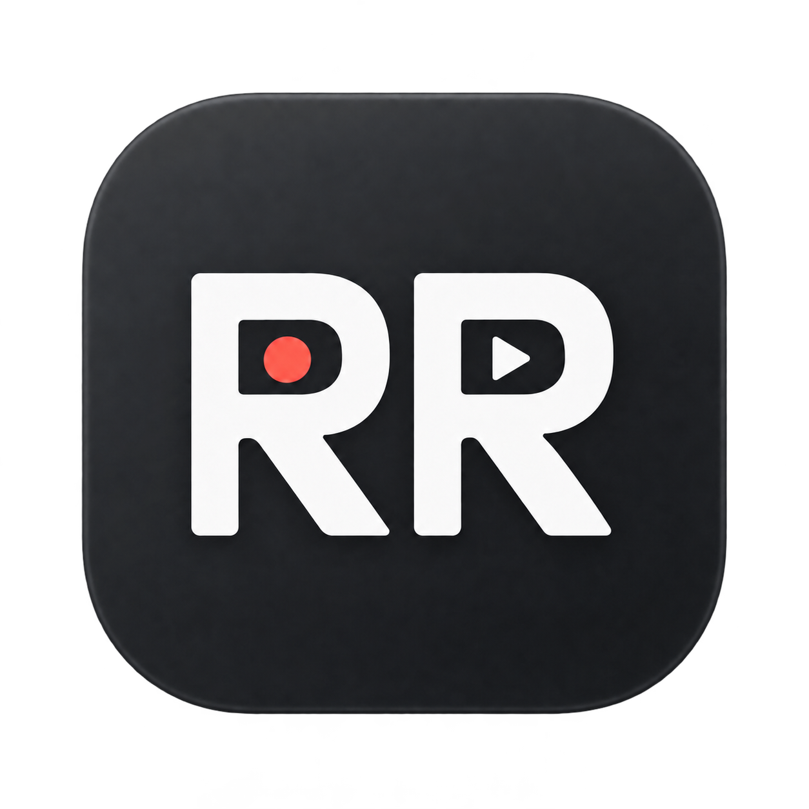
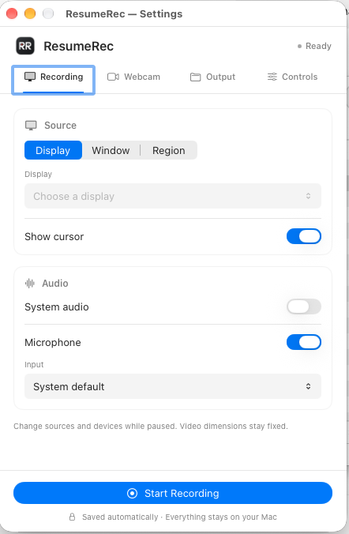

<p align="center">
  
</p>

<h1 align="center">ResumeRec</h1>

<p align="center">
  <strong>Record. Pause. Resume.</strong><br>
  A simple screen recorder that lives in your Mac’s menu bar.
</p>

<p align="center">
  <a href="https://github.com/lustri2002/ResumeRec/releases"></a>
  
  
  <a href="LICENSE"></a>
</p>

<p align="center">
  <a href="https://lustri2002.github.io/ResumeRec/">Website</a>
  &nbsp;·&nbsp;
  <a href="https://lustri2002.github.io/ResumeRec/#install"><strong>Download for Mac ↓</strong></a>
  &nbsp;·&nbsp;
  <a href="https://github.com/lustri2002/ResumeRec/releases">Release notes</a>
  &nbsp;·&nbsp;
  <a href="https://github.com/lustri2002/ResumeRec/issues">Report a bug</a>
</p>

---

Capture a display, a window or a region, with an optional webcam overlay, system audio and microphone. Pause when you need a break, resume when you’re ready, and save a single MP4 with the paused time removed.

**Free and open source. No account, tracking or subscription. Your recordings stay on your Mac.**

<p align="center">
  
</p>
<p align="center"><sub>Recording settings · Native macOS interface</sub></p>

## What you can do

| Feature | How it works |
| :--- | :--- |
| **Capture your screen** | Record a display, window or selected region, one monitor at a time. |
| **Pause and pick up where you left off** | Remove pauses from both video and audio. Change capture sources while paused. |
| **Put yourself in the picture** | Add a webcam overlay with a draggable desktop preview, eight preset positions, three shapes, a white border and mirroring. |
| **Choose your audio** | Enable system audio and microphone independently, and choose your input device. |
| **Set your recording quality** | Choose H.264 or HEVC, resolution, frame rate and capture bitrate. |
| **Keep the workflow simple** | Use a countdown, configurable shortcuts and saved preferences. Save timestamped MP4 files to your chosen folder. |

The webcam preview and its inclusion in the saved video are independent. Source and device lists refresh when you open their dropdowns.

## Install

**Requires an Apple Silicon Mac (M1 or newer) running macOS 26 or later.** Check the [release notes](https://github.com/lustri2002/ResumeRec/releases) for the current version and preview status.

1. [Download the current ResumeRec installer for Mac](https://lustri2002.github.io/ResumeRec/#install).
2. Open the DMG and drag **ResumeRec** onto **Applications**.
3. Eject the DMG and open ResumeRec from Applications.
4. Look for the **RR** icon in the menu bar and open **Settings**.

### First launch

The downloadable build is **ad hoc signed and not notarized by Apple**. macOS may block its first launch after download. If you trust this copy, try opening the app, then go to **System Settings → Privacy & Security → Open Anyway**, if available, and confirm the opening. Managed Macs may restrict this option. See [Apple's instructions](https://support.apple.com/en-us/102445).

You can also build the app from source. No paid Apple Developer membership is needed for this project's local ad hoc build.

<details>
<summary>Verify your download (SHA-256)</summary>

Download the matching `.dmg.sha256` file from the same [release](https://github.com/lustri2002/ResumeRec/releases) into the folder containing your DMG. Open Terminal in that folder and run (the wildcard matches the downloaded version):

```sh
shasum -a 256 -c ResumeRec-*-arm64.dmg.sha256
```

The result should end in `OK`. A checksum checks file integrity; it is not a developer identity certificate.

</details>

## Start recording

1. In **Output**, choose where recordings should be saved.
2. In **Recording**, choose a display, window or region and enable the audio sources you need.
3. In **Webcam**, optionally enable the camera and customize its shape, size, border and position.
4. Click **Start Recording**. Use the menu bar or configurable shortcuts to **Pause**, **Resume** and **Stop & Save**.

Allow screen recording, camera and microphone access when macOS asks. If screen access is unavailable, follow the instructions in Settings; quit and reopen ResumeRec if macOS requests it. Granting permission does not automatically start a recording.

## Build from source

Install Xcode or Command Line Tools with **Swift 6 and macOS SDK 26 or later**. Build on an Apple Silicon Mac. Swift 5 language mode is configured in the package.

```sh
git clone https://github.com/lustri2002/ResumeRec.git
cd ResumeRec
zsh scripts/build-app.sh
```

Open `dist/ResumeRec.app`. Use the app bundle when testing privacy permissions. The script builds Release and applies a local ad hoc signature; it does not install or launch the app.

To create a DMG:

```sh
zsh scripts/build-dmg.sh dist/ResumeRec.app
```

See [Development](DEVELOPMENT.md) for testing, architecture, build options and packaging details.

## Beta limitations

- Apple Silicon only; one monitor at a time. The interface is in English.
- Changing capture sources while paused preserves the recording’s original video dimensions.
- Saving joins segments, re-encodes video and mixes audio. It needs time and additional free disk space. Final export uses the selected codec's highest-quality preset; capture bitrate is not a strict final-file bitrate limit.
- System audio follows the selected ScreenCaptureKit source. There is no separate per-app audio selector.
- A closed or relaunched source window must be selected again.
- Recovery can salvage completed readable segments; a crash may lose the segment being written.
- No automatic updater. Save and quit, then replace the app in Applications when installing an update.
- The development environment is macOS 27. Feedback from macOS 26, external devices, mixed display scaling and different keyboard layouts is welcome.

## Privacy

ResumeRec does not upload recordings, collect analytics or contact an online service. Preferences are stored locally; recordings and temporary session files are saved in your chosen folder. macOS manages device permissions and may perform its own system security checks.

## Feedback and contributions

Report bugs or suggest features in [Issues](https://github.com/lustri2002/ResumeRec/issues). Include your app/macOS versions, Mac chip, recording settings and reproduction steps. Do not attach private recordings unless you intentionally want to share them publicly.

| Resource | What you’ll find |
| :--- | :--- |
| [Issues](https://github.com/lustri2002/ResumeRec/issues) | Bug reports and feature requests. |
| [Contributing](CONTRIBUTING.md) | How to propose and submit changes. |
| [Development](DEVELOPMENT.md) | Architecture, tests, build options and packaging. |
| [Changelog](CHANGELOG.md) | Changes included in each release. |

## License

[MIT](LICENSE) — Copyright © 2026 Alessio Lustri.
